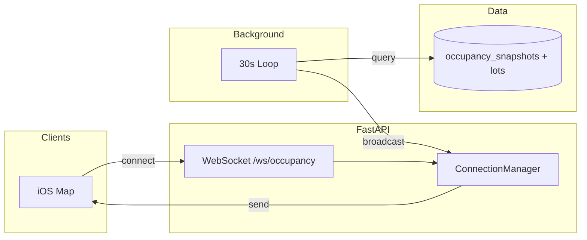
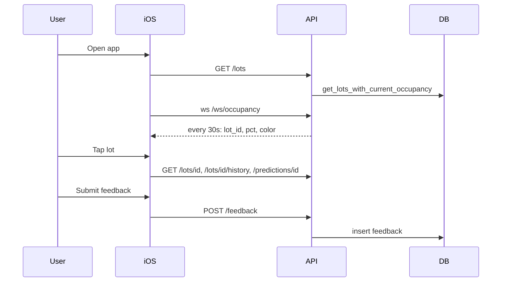

# Week 3: Shabeer + Together Deliverables

From [CONTEXT.md](c:\Users\soupr\OneDrive - George Mason University - O365 Production\ec_ Parkeye\parkeye_backend\CONTEXT.md):

- **Shabeer**: WebSocket hub (30-second occupancy broadcast), POST /feedback, GET /events.
- **Together**: Full user flow demo-able end-to-end: Home → Map → Lot Detail → Prediction → Feedback.

Current state: [app/main.py](c:\Users\soupr\OneDrive - George Mason University - O365 Production\ec_ Parkeye\parkeye_backend\app\main.py) registers only `lots`, `predictions`, and `admin`. No `websocket`, `feedback`, or `events` routers exist. Models and schemas for feedback and events already exist; occupancy service provides `get_lots_with_current_occupancy(db)` which is exactly what the WebSocket will broadcast.

---

## 1. WebSocket hub — 30-second occupancy broadcast (Shabeer)

**New file: [app/routers/websocket.py](app/routers/websocket.py)**

- **Endpoint**: `GET /ws/occupancy` (mount router with prefix `/ws` or no prefix and path `ws/occupancy` so full path is `ws://host/ws/occupancy`).
- **Behavior**:
  - On connect: add the WebSocket to a global set (e.g. `ConnectionManager` with `active_connections: set[WebSocket]`).
  - On disconnect: remove from set.
  - **Background broadcaster**: a single asyncio task that runs every 30 seconds:
    1. Open a DB session via `AsyncSessionLocal()` (from [app/database.py](app/database.py)).
    2. Call `get_lots_with_current_occupancy(db)` from [app/services/occupancy.py](app/services/occupancy.py) (already applies admin overrides).
    3. Build payload: list of `{ "lot_id": str, "occupancy_pct": float, "color": str }`.
    4. Send JSON to every connection in the set (catch and ignore send errors / closed connections).
    5. Close DB session.
- **App lifecycle**: Start the broadcaster task on app startup and cancel it on shutdown using FastAPI **lifespan** (context manager). The WebSocket router only handles accept/disconnect and registering connections; the actual loop runs in the lifespan.

**Lifespan in [app/main.py](app/main.py)**:

- Use `lifespan(app)` that:
  - On startup: create the broadcaster task (inject the connection manager and session factory or pass the app so the task can access the manager).
  - On shutdown: cancel the task and wait for it to finish.
- The connection manager (set of WebSockets) must be shared between the lifespan and the router; create it in the lifespan and attach to the app state, or use a module-level manager.

**Optional**: Add a small Pydantic schema for the broadcast payload (e.g. in [app/schemas/occupancy.py](app/schemas/occupancy.py)) like `OccupancyBroadcastItem` for documentation; the wire format is `[{ "lot_id", "occupancy_pct", "color" }, ...]` per CONTEXT.

---

## 2. POST /feedback (Shabeer)

**New file: [app/routers/feedback.py](app/routers/feedback.py)**

- **Route**: `POST /feedback`, body: [FeedbackCreate](app/schemas/feedback.py) (`lot_id`, `accuracy_rating`, `experience_rating`, `note?`).
- **Auth**: Optional. CONTEXT says user_id from JWT if present, else guest (nullable).
  - Add **optional auth dependency** in [app/auth.py](app/auth.py): e.g. `get_optional_user` that returns `User | None` (does not raise when `Authorization` is missing or invalid; optionally still validate token when present so invalid tokens are rejected).
  - In the route: `current_user: User | None = Depends(get_optional_user)`. Set `user_id = current_user.id if current_user else None`.
- **Logic**:
  - Verify `lot_id` exists (query [Lot](app/models/lot.py)); 404 if not found.
  - Insert into [Feedback](app/models/feedback.py): `id=uuid4()`, `user_id`, `lot_id`, `accuracy_rating`, `experience_rating`, `note`, `created_at=datetime.now(timezone.utc)`.
  - Commit and return 201 with a minimal body, e.g. `{ "id": "<uuid>", "created_at": "<iso>", "lot_id": "<uuid>" }`. Add a `FeedbackResponse` schema if desired (e.g. in [app/schemas/feedback.py](app/schemas/feedback.py)).

---

## 3. GET /events (Shabeer)

**New file: [app/routers/events.py](app/routers/events.py)**

- **Route**: `GET /events` — upcoming campus events for the **next 7 days** (per CONTEXT).
- **Service**: Extend [app/services/events.py](app/services/events.py) with a function that returns all upcoming events in the window (no lot filter), e.g.:
  - `get_upcoming_events(db: AsyncSession, within_days: int = 7) -> list[CampusEvent]`
  - Query: `start_time >= now`, `start_time <= now + timedelta(days=within_days)` (or use `end_time >= now` and `start_time <= cutoff` to include ongoing events). Order by `start_time`.
- **Response**: Reuse [EventSummary](app/schemas/event.py) (`id`, `title`, `start_time`, `end_time`, `impact_level`). Return either a list directly or wrap in `EventListResponse(events=[...])` for consistency with other list endpoints (e.g. [LotListResponse](app/schemas/lot.py)).

**Note**: [app/services/events.py](app/services/events.py) uses `CampusEvent.affected_lots.any(str(lot_id))` for lot-scoped events. For the new function we only filter by time range; no ARRAY predicate needed. If lot-scoped events ever misbehave, the ARRAY “contains” condition may need to be adjusted for PostgreSQL (e.g. proper use of `any_()` or array contains).

---

## 4. Together — Full flow wired and demo-able

**Updates in [app/main.py](app/main.py)**

- **Lifespan**: Add a lifespan context manager that starts the WebSocket broadcaster task and stops it on shutdown (as in section 1). Pass the shared connection manager into the WebSocket router (e.g. via app state or a shared module).
- **Routers**: Include the new routers:
  - `app.include_router(websocket.router)` (path/prefix so that WebSocket is `ws://.../ws/occupancy`).
  - `app.include_router(feedback.router)` (e.g. prefix `/feedback` or tag-only; route is `POST /feedback`).
  - `app.include_router(events.router)` (e.g. prefix so route is `GET /events`).
- **CORS**: Already configured; no change unless iOS needs additional origins.
- **Docs**: FastAPI auto-docs at `/docs` will include the new routes; ensure tags/descriptions are clear for the demo flow.

**Flow verification (demo script / README)**

- Document or add a short “Demo flow” checklist so the team can verify end-to-end:
  - **Home / Map**: `GET /lots` and `ws://host/ws/occupancy` (map data + live colors).
  - **Lot detail**: `GET /lots/{id}`, `GET /lots/{id}/history`, `GET /lots/{id}/floors` (decks only).
  - **Prediction**: `GET /predictions/{lot_id}`.
  - **Feedback**: `POST /feedback` with body `{ lot_id, accuracy_rating, experience_rating, note? }`.
  - **Events** (for context): `GET /events`.
- Optional: add a minimal smoke test or script that hits these in sequence; CONTEXT assigns full smoke tests to Week 4 (Sami), so Week 3 “Together” can be limited to wiring and a clear demo checklist.

---

## 5. File and dependency summary

| Piece                      | Action                                                                                  |
| -------------------------- | --------------------------------------------------------------------------------------- |
| `app/auth.py`              | Add `get_optional_user` (returns `User                                                  |
| `app/routers/websocket.py` | **New**: WebSocket accept/disconnect + connection set; broadcaster runs in lifespan     |
| `app/routers/feedback.py`  | **New**: POST /feedback, optional auth, validate lot, insert Feedback                   |
| `app/routers/events.py`    | **New**: GET /events using new service function                                         |
| `app/services/events.py`   | Add `get_upcoming_events(db, within_days=7)`                                            |
| `app/schemas/event.py`     | Optional: add `EventListResponse` if wrapping list                                      |
| `app/schemas/feedback.py`  | Optional: add `FeedbackResponse` for 201 body                                           |
| `app/main.py`              | Lifespan for broadcaster; register websocket, feedback, events routers                  |
| README or internal doc     | Short “Demo flow” checklist (endpoints for Home → Map → Detail → Prediction → Feedback) |

---

## 6. Architecture sketch (WebSocket + flow)

---

## 7. Order of implementation

1. **Auth**: Add `get_optional_user` in `auth.py`.
2. **Events service**: Add `get_upcoming_events(db, within_days=7)` in `services/events.py`.
3. **Events router**: Create `routers/events.py` with GET /events; optional `EventListResponse` in schemas.
4. **Feedback router**: Create `routers/feedback.py` with POST /feedback; optional `FeedbackResponse` in schemas.
5. **WebSocket**: Create connection manager and `routers/websocket.py`; implement broadcaster logic and lifespan in `main.py` so the 30s task runs and uses the same manager.
6. **Main**: Wire lifespan and register websocket, feedback, events routers.
7. **Docs**: Add “Demo flow” checklist (README or internal doc) for Home → Map → Lot Detail → Prediction → Feedback.

No database migrations are required; the `lots`, `occupancy_snapshots`, `campus_events`, and `feedback` tables and models already exist.